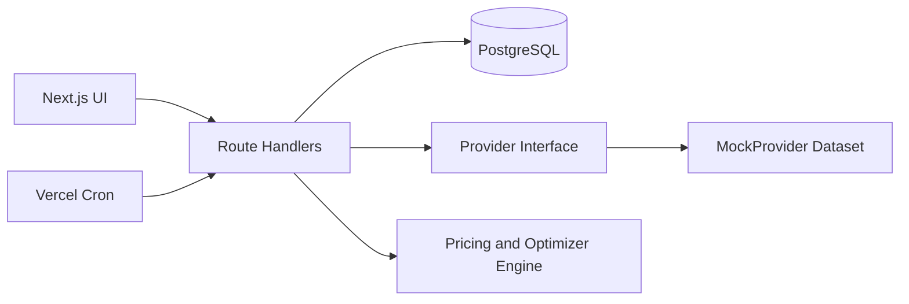

# Single-user options strategy visualizer v1 spec for a Next.js full-stack build

## Executive summary and scope

This document defines a tighter v1 implementation for a single-user options strategy visualizer inspired by the core builder and optimizer experience of OptionStrat, but intentionally reduced in scope to keep the first production build realistic.

The application is a full-stack Next.js app with no authentication, no billing, and no account system. Persisted data is owned by the single running instance. The v1 product includes:

- a strategy builder with interactive edits and immediate recalculation
- a strategy library using exact OptionStrat strategy names for the chosen v1 subset
- an optimizer that evaluates candidate strategies against a target and ranks them
- saved strategies with mark-to-market tracking over time
- a provider abstraction layer with a deterministic mock provider as the only shipped provider in v1

The application is educational software. It must clearly communicate that option valuations are model-based estimates and not trading advice.

## Confirmed v1 product decisions

These decisions are locked for this version of the spec:

- vendor agnostic architecture, but no real market-data vendor is selected yet
- v1 ships with mock provider only
- unusual options flow is completely out of scope
- share links are completely out of scope
- dividends are completely out of scope
- no sentiment grouping requirements
- no proficiency grouping requirements
- no dedicated cache layer in v1
- Vercel is the primary deployment target
- no partial closes; a saved strategy is either open or closed

## Goals

The implementation must include:

- an interactive strategy builder where the user can change strikes, expiries, quantities, pricing assumptions, commissions, and valuation horizon and see immediate recalculation
- a profit and loss table where rows are underlying prices and columns are future dates
- a chart view for a selected date slice with exact profit and loss on hover
- summary metrics including net debit or credit, max profit, max loss, breakevens, net greeks, chance of profit at the selected horizon, and chance of profit at expiration
- a strategy library for the approved v1 subset using exact OptionStrat strategy names
- an optimizer that searches a bounded candidate set and ranks results by objective
- local saved strategies with mark-to-market tracking snapshots
- a settings area for commissions, defaults, and provider diagnostics

## Non-goals

The following are explicitly out of scope for v1:

- authentication, accounts, subscriptions, or billing
- unusual options flow of any kind
- shareable links or public read-only strategy pages
- dividend modeling, including dividend yield and discrete dividends
- ex-dividend events
- portfolio import or brokerage integration
- futures options
- dedicated Redis or DB cache infrastructure
- sentiment or proficiency grouping in the strategy library
- partial closing of trades

## Product requirements and user experience

### Primary screens

The application UI is composed of these screens:

- Home / Search
- Strategy Builder
- Strategy Library
- Optimizer
- Saved Strategies
- Settings

### Core workflows

#### Home / Search

The home screen provides:

- symbol search
- quick links into Builder, Library, Optimizer, and Saved
- a short explanation that the app is educational and model driven

#### Strategy Builder

The builder is the primary screen and must support:

- opening with an underlying symbol selected
- loading a template from the strategy library
- editing legs directly
- changing strike, expiry, quantity, side, and entry-price mode
- changing valuation horizon in days
- changing implied volatility assumptions
- changing risk-free rate assumptions
- changing commissions
- switching between table, chart, and greeks views
- saving the current strategy locally

Desktop uses a two-pane layout. Mobile uses a single-column stacked layout with collapsible control sections. All critical interactions must be keyboard accessible.

#### Strategy Library

The library is a simple list or grid of strategy templates. It uses exact OptionStrat strategy names for the approved v1 set, but it does not require sentiment filters or proficiency groupings.

Each library item includes:

- strategy name
- short description
- leg pattern summary
- open in builder action

#### Optimizer

The optimizer lets the user choose:

- underlying symbol
- thesis type
- target price
- target date or expiration window
- objective
- constraints

The optimizer produces ranked candidate trades and allows any result to be opened in the builder.

#### Saved Strategies

Saved Strategies supports:

- save current builder state
- rename saved strategies
- reopen saved strategies in the builder
- view historical mark-to-market snapshots
- close the full strategy
- view realized or unrealized profit and loss

There is no share link feature in v1.

#### Settings

Settings includes:

- commission defaults
- default grid settings
- default implied volatility override behavior
- default risk-free rate
- provider mode diagnostics

## Strategy library v1

The library and optimizer must support this initial strategy subset using exact OptionStrat naming:

- Long Call
- Long Put
- Short Call
- Short Put
- Bull Call Spread
- Bear Put Spread
- Bull Put Spread
- Bear Call Spread
- Iron Condor
- Long Straddle
- Long Strangle
- Covered Call
- Cash-Secured Put

The system should be designed so additional strategies can be seeded later without changing the builder architecture.

## Strategy Builder requirements

### Header row

The sticky header contains:

- symbol search and selected underlying
- one or more selected expirations
- save, reset, and settings actions

### Left pane: builder controls

The builder controls include:

- strategy template selector
- leg editor table
- strike and expiry controls
- quantity controls
- price input mode: bid, ask, mark, mid, or manual
- implied volatility controls:
  - global override
  - per-expiry overrides
- valuation horizon control in days
- risk-free rate source and manual override
- commissions controls

### Right pane: analytics

The analytics pane includes summary cards:

- net debit or credit
- max profit
- max loss
- breakevens
- chance of profit at selected horizon
- chance of profit at expiration
- net greeks

The analytics pane has these tabs:

- Table view
- Chart view
- Greeks view

### Table view

The profit and loss table must support:

- rows as underlying prices
- columns as future dates
- toggle between dollars, percent change, percent of risk, and contract value
- a configurable chart-range or price-range control
- highlighting the selected date and price on hover

### Chart view

The chart view must support:

- one selected future date slice at a time
- hover to show exact price and profit or loss
- breakeven lines
- probability distribution overlay
- implied move lines at plus and minus 1x implied move
- implied move lines at plus and minus 2x implied move

### Greeks view

The greeks view must support:

- net delta
- net gamma
- net theta
- net vega
- net rho
- display over the selected valuation horizon

## Optimizer requirements

### Inputs

The optimizer accepts:

- underlying symbol
- target price
- target date or expiration window
- objective:
  - max return
  - max chance of profit
- constraints:
  - max loss
  - max legs
  - strike window
  - minimum liquidity thresholds if real providers are added later

### Objective definitions

For v1, objective definitions are:

- max return: rank by highest expected profit and loss at the user-selected target date and target price, subject to constraints
- max chance of profit: rank by highest modeled probability of positive profit and loss, subject to constraints

These definitions must be explicit in the UI so the ranking behavior is not hidden.

### Search scope

The optimizer only searches the approved v1 strategy subset. It does not attempt to cover the full long-tail OptionStrat strategy catalog in v1.

### Results

Each result includes:

- strategy name
- leg summary
- entry debit or credit
- max profit
- max loss
- breakevens
- chance of profit at horizon
- chance of profit at expiration
- expected profit and loss at target date and target price
- open in builder action

## Saved strategies and mark-to-market tracking

Saved strategies are instance-owned data with no account system.

Each saved strategy stores:

- name
- creation and update timestamps
- status: open or closed
- entry timestamp
- normalized legs
- full builder state snapshot

Mark-to-market tracking requirements:

- scheduled snapshots must record current net value and unrealized profit and loss for each open strategy
- historical snapshots must be viewable on the Saved Strategies screen
- closing a strategy is an all-legs close action
- closing stores exit prices and close timestamp
- realized profit and loss is computed at close

## Market data provider architecture

### Provider strategy

The system must be vendor agnostic. All market-data access happens behind a provider interface so a real adapter can be added later without changing the UI or domain models.

The v1 implementation ships with:

- one deterministic MockProvider

The v1 implementation does not ship with:

- a real market-data provider adapter

### Mock provider requirements

The mock provider must be first-class and used for local development, CI, and end-to-end tests.

It must provide:

- predefined underlying instruments
- option chains for at least 3 underlyings
- at least 4 expiries per underlying
- consistent bid, ask, mark, volume, open interest, implied volatility, and basic greeks
- deterministic quotes for repeated test runs

The mock dataset must be versioned in the repository and generated from a script.

### No dedicated cache layer in v1

V1 does not include Redis, cache tables, or a dedicated compute cache. The implementation should keep the architecture open to caching later, but the spec does not require it now.

## Pricing and analytics

### Modeling assumptions

The pricing engine must clearly document that values are model outputs under simplifying assumptions. Inputs include:

- underlying price
- strike price
- time to expiration
- implied volatility
- risk-free rate

Dividend inputs are not modeled in v1.

### Required pricing models

The engine must implement:

- Black-Scholes-Merton for European-style scenario valuation
- Bjerksund-Stensland style American approximation for American-style options

This model choice is fixed for v1 so the implementation is consistent across builder, optimizer, and saved-strategy tracking.

### Why time-dependent valuation matters

The builder must show expected profit and loss at future dates before expiration, not only intrinsic value at expiration. That requires time-dependent theoretical valuation for each leg across the table and chart grids.

### Probability distribution and chance of profit

The distribution overlay is modeled under a lognormal assumption aligned with the pricing engine.

The system must calculate both:

- chance of profit at the selected horizon
- chance of profit at expiration

Chance of profit means the probability that modeled net profit and loss is greater than zero after commissions.

### Performance target

For standard grids such as 41 price points by 11 dates, builder recomputation should remain responsive on a typical developer laptop in mock mode. If the chosen implementation cannot hold the target comfortably, the UI should degrade gracefully through smaller default grids or staged rendering.

### Risk-free rate

V1 uses a configurable default risk-free rate in settings, with manual override per calculation. Automatic Treasury ingestion is not required in this version.

## API surface

All backend endpoints are implemented as Next.js Route Handlers under the App Router.

The minimum required endpoints are:

| Feature | Endpoint | Notes |
|---|---|---|
| Symbol search | `GET /api/market/symbols?q=` | Uses provider interface |
| Underlying quote | `GET /api/market/quote?symbol=` | Uses provider interface |
| Option expirations | `GET /api/options/expirations?symbol=` | Uses provider interface |
| Option chain | `GET /api/options/chain?symbol=&expiry=` | Uses provider interface |
| Strategy templates | `GET /api/strategies/templates` | Seeded static data |
| Strategy valuation | `POST /api/strategies/calc` | Builder analytics |
| Optimizer run | `POST /api/optimizer/run` | Candidate generation and ranking |
| Saved strategy list/create | `GET /api/saved`, `POST /api/saved` | Local persistence only |
| Saved strategy detail/update | `GET /api/saved/{id}`, `PUT /api/saved/{id}` | Local persistence only |
| Saved strategy close | `POST /api/saved/{id}/close` | Full close only |
| Saved strategy snapshot | `POST /api/saved/{id}/snapshot` | Internal scheduled use |
| Settings | `GET /api/settings`, `PUT /api/settings` | Single-user settings |

Endpoints that are intentionally removed from scope:

- all flow endpoints
- all share-link endpoints
- all events and ex-dividend endpoints

## Data model and relational schema

### Recommended database

Use PostgreSQL as the default database for Vercel deployment and local development.

Use a migration-based ORM such as Prisma or Drizzle. Migrations must run in CI.

### Core entities

The schema only needs to cover v1 systems. A recommended starting schema is:

| Table | Purpose | Key fields |
|---|---|---|
| `instrument` | Underlying instruments | `id`, `symbol`, `name`, `asset_type`, `currency`, `exchange`, `created_at` |
| `option_contract` | Canonical option definitions | `id`, `instrument_id`, `expiry`, `strike`, `right`, `exercise_style`, `contract_symbol`, `multiplier` |
| `strategy_template` | Seeded library definitions | `id`, `name`, `legs_spec`, `description`, `created_at` |
| `saved_strategy` | Persisted builder state | `id`, `instrument_id`, `template_id`, `name`, `status`, `entry_ts`, `close_ts`, `builder_state`, `created_at`, `updated_at` |
| `saved_strategy_leg` | Normalized saved legs | `id`, `saved_strategy_id`, `kind`, `side`, `qty`, `option_contract_id`, `entry_price`, `close_price` |
| `saved_strategy_snapshot` | Mark-to-market history | `id`, `saved_strategy_id`, `ts`, `net_value`, `unrealized_pnl`, `max_unrealized_pnl`, `min_unrealized_pnl` |
| `app_settings` | Single-user settings | `id`, `commissions`, `defaults`, `provider_config`, `updated_at` |

### Schema rules

- store timestamps as `timestamptz`
- store money as `numeric`
- reject floating-point persistence for monetary values
- keep the normalized legs table even though builder state is also stored as JSON

Tables intentionally removed from the earlier broader spec:

- flow tables
- event calendar tables
- share-link fields such as `share_slug`
- cache tables

## Next.js architecture

### Application structure

Use Next.js App Router with:

- server components for page shells and initial data loading where appropriate
- client components for builder controls, charts, and optimizer interactions
- Route Handlers for all backend endpoints

Suggested repository structure:

- `app/`
- `src/domain/`
- `src/providers/`
- `src/engine/`
- `src/db/`
- `src/components/`
- `docs/`

### SSR and CSR split

Server-rendered or server-first pages:

- Home / Search shell
- Strategy Library shell
- Saved Strategies shell
- Settings shell

Client-heavy areas:

- Strategy Builder controls
- profit and loss charts and tables
- optimizer form and result interactions
- saved-strategy tracking charts

## Scheduling and background jobs

Saved strategy mark-to-market tracking requires scheduled execution.

V1 uses Vercel Cron Jobs as the primary scheduling mechanism.

Scheduled jobs must:

- iterate open saved strategies
- fetch current quote and chain data through the provider interface
- compute current net value
- persist a snapshot to `saved_strategy_snapshot`

No flow-ingestion jobs are required because flow is out of scope.

## Security and operational baseline

Even without authentication, the application must implement:

- Zod validation on all write endpoints
- rejection of unknown payload fields
- same-origin API usage by default
- environment-variable based configuration
- server-side-only provider access
- consistent structured API error responses

Recommended error payload shape:

```json
{
  "error": {
    "code": "VALIDATION_ERROR",
    "message": "Invalid strategy payload"
  },
  "requestId": "..."
}
```

Rate limiting is still recommended at the host or middleware layer, but the earlier cache and flow-specific operational complexity is removed from this v1 spec.

## Deployment and hosting

Vercel is the primary deployment target for v1.

The reference deployment shape is:

- Next.js app on Vercel
- PostgreSQL database
- Vercel Cron for saved-strategy snapshots

The implementation must not hard-code Vercel-specific assumptions into the domain model, but Vercel is the documented first-class deployment path.

## Testing strategy

### Unit tests

Required unit coverage areas:

- pricing engine boundary conditions
- monotonicity checks
- chance-of-profit calculations
- max profit and max loss calculations for each supported strategy template
- optimizer ranking logic

### Integration tests

Required integration coverage areas:

- route handlers with mock provider
- database persistence for save, load, close, and snapshot flows
- settings read and update flows

### End-to-end tests

Use Playwright against the mock provider.

Minimum scenarios:

- open builder and load a supported template
- adjust strikes and verify profit and loss updates
- change implied volatility and valuation horizon and verify analytics update
- run optimizer and open a result in builder
- save a strategy and verify it appears in Saved Strategies
- close a strategy and verify realized profit and loss is shown

### Coverage targets

Recommended targets:

- 85 percent or greater line coverage overall
- 95 percent or greater for pricing engine and optimizer ranking logic

## Delivery plan

### Milestones

| Milestone | Timebox | Deliverables | Acceptance criteria |
|---|---:|---|---|
| Project foundation | 2-3 days | Next.js skeleton, DB migrations, linting, test setup, base layout | CI passes; migrations run cleanly |
| Mock provider and market routes | 3-5 days | Provider interface, MockProvider, symbol, quote, expirations, and chain endpoints | App runs fully without external API keys |
| Strategy library and builder core | 6-9 days | Template seed data, builder UI, leg editor, table and chart views | All supported templates open and recalculate correctly |
| Pricing engine and analytics | 6-9 days | Pricing engine, greeks, chance-of-profit, distribution overlay | Analytics respond correctly to IV, price, and time changes |
| Optimizer | 4-7 days | Candidate generation, ranking, result UI, builder handoff | Results are deterministic in mock mode |
| Saved strategies and tracking | 4-6 days | Save, load, close, mark-to-market snapshots, saved views | Snapshots persist and close flow works end to end |
| Hardening and deploy | 3-5 days | Accessibility pass, docs, Vercel deployment, final E2E coverage | Deploy guide works and tests pass |

## Documentation expectations

The repository should include:

- `README.md` for setup and local development
- `docs/ARCHITECTURE.md` for runtime and data-flow diagrams
- `docs/PRICING_MODEL.md` for modeling assumptions and limitations
- `docs/OPERATIONS.md` for Vercel deployment and cron setup
- `docs/MOCK_PROVIDER.md` for dataset generation and maintenance

## Suggested architecture diagram



## Sample API contract

### Calculate strategy

```json
{
  "request": {
    "method": "POST",
    "path": "/api/strategies/calc",
    "body": {
      "symbol": "AAPL",
      "valuationTs": "2026-03-25T18:30:00Z",
      "horizonDays": 21,
      "riskFreeRate": 0.042,
      "commissions": { "perContract": 0.65, "perLegFee": 0.0 },
      "ivOverrides": { "global": 0.25, "byExpiry": { "2026-04-17": 0.26 } },
      "legs": [
        { "kind": "option", "side": "buy", "qty": 1, "right": "C", "strike": 205, "expiry": "2026-04-17", "entryPrice": "mark" },
        { "kind": "option", "side": "sell", "qty": 1, "right": "C", "strike": 215, "expiry": "2026-04-17", "entryPrice": "mark" }
      ],
      "grid": { "pricePoints": 41, "datePoints": 11, "priceRangePct": 0.25 }
    }
  },
  "response": {
    "summary": {
      "netDebit": 280.0,
      "maxProfit": 720.0,
      "maxLoss": 280.0,
      "breakevens": [207.8],
      "chanceOfProfitAtHorizon": 0.51,
      "chanceOfProfitAtExpiration": 0.46,
      "netGreeks": {
        "delta": 0.18,
        "gamma": 0.01,
        "theta": -0.03,
        "vega": 0.05,
        "rho": 0.02
      }
    },
    "grid": {
      "prices": [153.84, 156.4, 158.96],
      "dates": ["2026-03-25", "2026-04-01", "2026-04-08"],
      "values": [[-280.0, -250.1, -221.2]]
    },
    "chart": {
      "selectedDate": "2026-04-01",
      "series": [
        { "price": 180.0, "pnl": -280.0 },
        { "price": 205.0, "pnl": 10.0 }
      ],
      "probabilityOverlay": {
        "impliedMove1x": { "down": 196.2, "up": 214.8 },
        "impliedMove2x": { "down": 187.3, "up": 225.1 }
      }
    }
  }
}
```

## Prioritized backlog

| Priority | Epic | Story | Acceptance criteria |
|---:|---|---|---|
| P0 | Market data | Load symbols, expirations, and chains in mock mode | No external API keys required |
| P0 | Builder | Build any supported template and see table and chart analytics | Recalculation is immediate and stable |
| P0 | Analytics | View max profit, max loss, breakevens, greeks, and both chance-of-profit values | Canonical strategies pass unit tests |
| P1 | Optimizer | Run optimizer and open a result in builder | Ranking is deterministic in mock mode |
| P1 | Saved strategies | Save, reopen, track, and close strategies | Snapshots and realized PnL work |
| P2 | Hardening | Add accessibility, docs, and deployment polish | Vercel deployment documented and tested |

## Codex implementation prompt

```text
You are Codex acting as a senior full-stack engineer. Implement this project end to end in Next.js App Router as a single-user full-stack application with a relational database.

Critical rules:
- No placeholders. No TODOs. Do not stub core behavior.
- Single-user only. No authentication. No billing.
- Persist all user data as instance-owned local application data.
- All market-data access must go through a provider interface.
- Ship with a deterministic MockProvider only in v1.
- Do not implement unusual options flow.
- Do not implement share links.
- Do not implement dividend modeling.
- Do not implement a dedicated cache layer in v1.

Scope to implement:
1. Screens: Home/Search, Strategy Builder, Strategy Library, Optimizer, Saved Strategies, Settings.
2. Strategy Library:
   - Seed the exact approved v1 strategy names:
     Long Call, Long Put, Short Call, Short Put, Bull Call Spread, Bear Put Spread,
     Bull Put Spread, Bear Call Spread, Iron Condor, Long Straddle, Long Strangle,
     Covered Call, Cash-Secured Put.
3. Strategy Builder:
   - Leg editor, strike and expiry controls, quantity controls, IV overrides,
     valuation-horizon control, commission controls, and risk-free-rate controls.
   - Profit and loss table and chart views.
   - Summary metrics including max profit, max loss, breakevens, net greeks,
     chance of profit at selected horizon, and chance of profit at expiration.
   - Probability overlay with implied move lines at plus/minus 1x and 2x.
   - Local save action only. No sharing.
4. Pricing engine:
   - Black-Scholes-Merton for European scenario valuation.
   - Bjerksund-Stensland style American approximation for American options.
   - Net greeks aggregation.
   - Probability distribution under a lognormal assumption.
   - Chance of profit after commissions for selected horizon and expiration.
5. Optimizer:
   - Search only the approved v1 strategy subset.
   - Rank by either highest expected PnL at target date/price or highest chance of profit.
   - Open any result in the builder.
6. Saved strategies:
   - Save and load strategy state locally.
   - Mark-to-market snapshots via scheduled job.
   - Full close only. No partial closes.
7. Quality:
   - TypeScript strict.
   - Thin route handlers.
   - Zod validation for all writes.
   - Unit, integration, and Playwright E2E coverage in mock mode.
8. Deployment:
   - Vercel-first deployment path with PostgreSQL and Vercel Cron.

Deliverables:
- Working app in mock mode with no external API keys.
- Complete docs for setup, pricing model, architecture, and Vercel operations.
- CI passing with tests and migrations.
```
